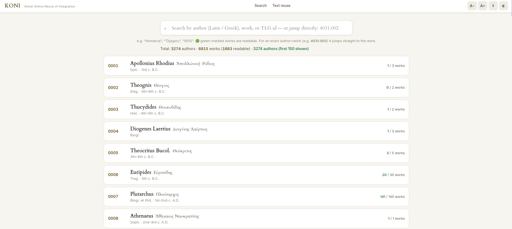
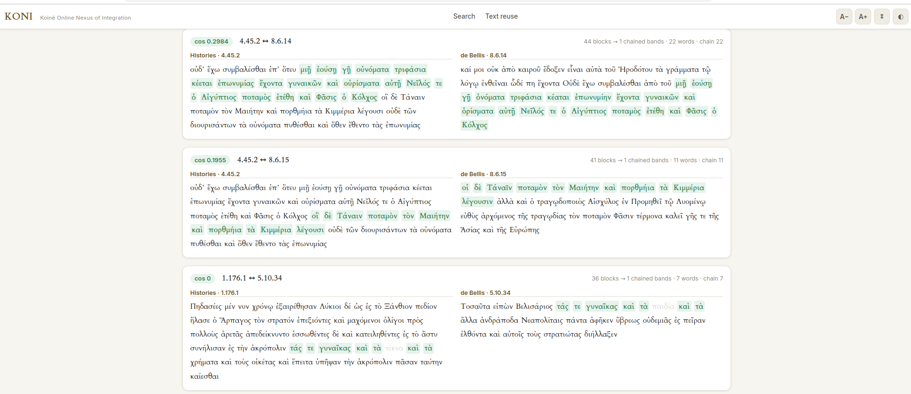

# KONI — Κοινή Online Nexus of Integration
[](LICENSE)
[-blue.svg)](https://github.com/kreeedit/FLAME)
[](https://creativecommons.org/licenses/by-sa/4.0/)
[](NOTICE)
[](schema/context.jsonld)


<div align="center">
<b>An Open Canon Index, a Reader, and a Zero-Dependency Text-Reuse Engine</b>
    
<blockquote>
<div align="center">
<i>KONI turns scattered, human-only canon sources into one searchable, readable, research-grade text-reuse system — while being honest about what each piece is, where it came from, and what you may do with it.</i>
</div>
</blockquote>
<pre>
    __ ______  _    ______
   / //_/ __ \/ | / /  _/
  / ,< / / / /  |/ // /
 / /| / /_/ / /|  // /
/_/ |_\____/_/ |_/___/
</pre>


<b>[ Engine: two-phase Flame | Reader + Engine deps: ZERO | Provenance: tracked, honestly ]</b>
</div>

**KONI** is a lightweight workstation for classical philologists and digital
humanists. It does three things: it builds a **machine-readable, Linked-Open-Data
index of the TLG (Thesaurus Linguae Graecae) canon** from public sources; it
serves a **zero-dependency web reader** for the openly-licensed Greek texts; and
it runs a **two-phase text-reuse engine** ("Flame") that surfaces quotations,
imitations, and formulaic echoes across ancient and Byzantine Greek — built for
the realities of a heavily inflected, dialectally varied language.

---

## 1. A machine-readable Canon index



The TLG canon — the index assigning every author a 4-digit ID (Homer = `0012`)
and every work a 3-digit ID (Iliad = `001`) — is the backbone that links an
identifier to an actual text. KONI assembles a normalized index
(`canon.json` / `canon.csv`) by reconciling several public sources, and is
**honest about provenance**: every author records which source(s) it came from,
and every work carries a `cts_confirmed` flag (`true` = a real, openly-licensed
text exists for it; `false` = attested in the canon but with no open text yet).

This index is **built locally** by the ETL pipeline on your machine. The
project does **not** redistribute the canon assembled from restricted sources.

**Linked Open Data (JSON-LD).** The canon is an *authority list of entities*,
not a corpus of texts — so it fits Linked Open Data naturally. `scripts/build_jsonld.py`
emits the index as JSON-LD (`canon.jsonld`) anchored on **LAWD / SKOS / Dublin
Core / PROV**. Every author and work gets a stable `koni:` URI; authors carry
`skos:exactMatch` links to **Wikidata** (`wd:`) and **VIAF**; confirmed works
link to their dereferenceable **Scaife** text, and works with no open text yet
are flagged `koni:proposed` — so the canon can also *suggest the URIs that are
still missing*. The publishable `@context` lives at
[`schema/context.jsonld`](schema/context.jsonld), and the whole graph validates
as RDF under a standard JSON-LD processor.

```jsonc
{
  "id": "koni:0059", "type": "Author",
  "name_grc": "Πλάτων",
  "exactMatch": "wd:Q859",                 // Wikidata (CC0), via TLG-id ↔ P3576
  "works": [{
    "id": "koni:0059.001", "type": "Work",
    "title_en": "Euthyphro",
    "cts_urn": "urn:cts:greekLit:tlg0059.tlg001",
    "ctsConfirmed": true,
    "exactMatch": "https://scaife.perseus.org/library/urn:cts:greekLit:tlg0059.tlg001/"
  }]
}
```

`build_jsonld.py --links` then writes the two **publishable** graphs, kept in
separate files so their licences never mix:

- **`canon-links.nt`** — a **CC0** cross-reference graph of nothing but `koni:` /
  Scaife ↔ public Wikidata / VIAF edges (identifiers and links only).
- **`canon-editions.nt`** — the per-work source-edition citations: the open TEI
  editions (**CC BY-SA**, from First1KGreek / Perseus) plus your own
  `local:curated` entries.

The full **`canon.jsonld`** carries TLG-derived names, epithets, and titles, so
it **stays local**.

---

## 2. The Flame text-reuse engine

Flame is a **two-phase** pipeline — deliberately not a plagiarism string-matcher.
It is tuned for oral-formulaic phrasing and historiographical imitation (e.g.,
**Procopius reworking Herodotus**) across inflectional and dialectal variation.

**Phase 1 — candidate generation & ranking.** Texts are chunked at
**citation-unit granularity** (the deepest TEI `textpart`, e.g. `8.6.14`), not
whole books, so matches stay localized. A pure-Python **BPE subword** model
(`collections.Counter`, `re`, `unicodedata`) feeds a **TF-IDF cosine** score
that ranks how related two units are, while an **inverted word-bigram index**
selects only the unit-pairs that actually share material — no dense, all-pairs
scan over millions of combinations.

**Phase 2 — local alignment.** On the candidate pairs, Flame aligns the
accent-flattened word lists with a hand-rolled **Levenshtein-tolerant** matcher:
two words count as "the same" when their edit-ratio clears the *Fuzzy
threshold*. This is what lets Ionic `ποταμόν` align with Attic `ποταμὸς` with no
external library. Adjacent runs are fused across up to `n_out` non-matching
words (**leave-N-out**), and **strict core/chain filters** discard isolated
particle noise (`τε`, `καὶ`, `δὲ`), so only real reuse survives. (No
agglomerative chaining — the filters do that work.)

**Accent-insensitive by design.** A pre-tokenization pass uses Unicode `NFKD`
normalization to strip polytonic breathings, accents, and iota subscripts, so
matching is robust across variant print editions; the *original* accented words
are always kept for display.

> **Worked example (verified):** comparing Procopius, *de Bellis* `8.6` with
> Herodotus, *Histories* `4.45` recovers the continents-naming formula
> (Nile / Phasis / Colchian / Tanais) as one long chain — exactly the kind of
> short, dialectally-shifted citation a global vector filter would bury.



---

## 3. Citation-anchored, streaming, exportable

- **Canonical citation binding (CTS / URN).** Every snippet stays bound to its
  metadata: author, work title (Latin / Greek), edition, section, and word
  range, hanging off a standard `urn:cts:greekLit:…` URN.
- **Direct-comparison threshold bypass.** For sweeps, Flame computes an
  automatic noise cutoff (`mean + 1.2·σ`); for a direct two-work comparison that
  auto-threshold is **disabled** and the cosine cutoff drops to `0.0`, rescuing
  short 2–3-word micro-phrases instead of filtering them away.
- **Streaming results + live progress.** The comparison endpoint **streams**
  matches (NDJSON), strongest first, so the first hits render immediately while
  the rest load in the background — with an hourglass, a determinate progress
  bar, and a live "X matches · Y%" counter.
- **Recompute on a button, not on every nudge.** Server-side sliders (n-gram /
  n-out / min-chain / fuzzy) stage their change and light up an **↻ Recompute**
  button, so you adjust several at once and run a single pass. The client-side
  filters (cosine, bridge-word colour) still apply live.
- **Zero visual drift.** Phase 2 matches directly on whole-word lists, so hit
  indices *are* word indices — highlights (Cardo / Noto Serif Greek) land on the
  exact words, and clicking a match scrolls its counterpart into view.
- **High-fidelity export.** One click compiles the current alignment into a
  publication-ready **TSV** with print-edition metadata, cosine scores, word
  ranges, and exact local snippets — ready for footnotes or a database.

---

## Runtime hyperparameter tuning

| Parameter | Range | Effect | Philological use |
| :--- | :--- | :--- | :--- |
| **N-Gram** | `3 – 8` | Required length of the contiguous match core. | Short formulae ↔ long citations. |
| **N-Out** | `0 – 2` | Gap-fusing window. `0` = strict contiguous; `1–2` tolerate inserted/swapped words. | Verbatim quotation ↔ paraphrase. |
| **Fuzzy (Levenshtein)** | `0.50 – 1.00` | Word-equality tolerance. Lower it (~0.65–0.70) to catch near-identical dialectal/inflectional variants. | **The key dial for "near-identical" reuse.** |
| **Min Chain** | `2 – 10` | Minimum total matched words per block. | Discards fragmentary grammatical noise. |
| *Cosine threshold* (client) | `0 – 1` | Hides low-similarity pairs after the fact. Keep low for short formulae. | Quick precision filter. |
| *Bridge fuzzy* (client) | `0 – 100` | Colours bridge words similar / dissimilar. | Visual reading aid. |

---

##  Architecture & data flow

```
ETL (canon build — runs locally)
  public sources ──► parse + merge + enrich ──► canon.json / canon.csv
       local/supplement.json ──► (curation overlay, tiered)  ┘   │
                                                 ├──► Diogenes export (CSV + SQLite)
                                                 └──► JSON-LD / LOD
                                                       canon.jsonld        (local; TLG-derived)
                                                       canon-links.nt      (publishable; CC0)
                                                       canon-editions.nt   (publishable; CC BY-SA + curated)
                                                       └─ firewall drops restricted:* tiers

Reader + Flame (runtime, stdlib only)
  openly-licensed TEI / CTS text ──► citation-unit chunking
        └──► Flame  Phase 1: BPE-subword TF-IDF + inverted bigram index (ranking)
                    Phase 2: Levenshtein word-block alignment (local match)
                        └──► streamed, highlighted alignments ──► TSV export
        Vanilla-JS SPA: search · author pages · two-pane reader · compare view
```

The Diogenes **SQLite** file is an *export* of the canon (for Diogenes/Perseus
interop), not an input to the matching engine — the engine reads the TEI texts
directly.

---

## Quick start
**1) Install ingestion tools (one-time)**
```bash
pip install -r requirements.txt
```
**2) Fetch sources (one-time). The canon index is NOT shipped in git. Build it locally once from the public sources:**
```bash
python scripts/fetch_sources.py
```
**3) Build canon (one-time)**
```bash
python scripts/build_canon.py
```
**4) Launch the zero-dependency Flame engine & reader**
```bash
python scripts/serve.py
```

In **Flame · compare**: pick two works with the autocomplete pickers, hit
**Compare**, watch matches stream in, then tune the sliders and press
**↻ Recompute**. Click a highlighted word to jump to its counterpart; export as TSV.

**3) Optional — export the canon as Linked Open Data (JSON-LD)**
```bash
python scripts/build_canon.py            # build the canon index first (if not yet built)
python scripts/build_jsonld.py --links   # -> data/canon.jsonld + data/canon-links.nt
```

---

## License & data provenance

KONI bundles **three different kinds of thing**, and they are *not* under one
license. ⚠️ Read this first: KONI touches sources with very different legal status (from MIT and CC BY-SA to copyrighted/restricted materials like the TLG). What it may redistribute, what it only builds locally, and what is off-limits are spelled out in the [NOTICE](./NOTICE) file. That file is not an afterthought — it is the difference between a tool you can publish and one you can only run privately.

> **Licensing (mixed).** KONI's own code is **MIT** (see [`LICENSE`](LICENSE)).
> The Flame engine reimplements **[FLAME](https://github.com/kreeedit/FLAME)**
> (Apache-2.0, same author). Loaded/bundled data is licensed separately — Greek
> texts **CC BY-SA 4.0**, Wikidata **CC0**; TLG-derived and unlicensed sources
> are **not redistributed**. Full breakdown in [`NOTICE`](NOTICE).

The Linked-Open-Data outputs follow the same rule: the full **`canon.jsonld`**
is built from the TLG-derived canon and **stays local**, while **`canon-links.nt`**
— only the `koni:`/Scaife ↔ Wikidata (CC0) / VIAF cross-reference edges — is the
publishable LOD subset.

---

## Technical audit

* **Reader + Flame engine — Python standard library only:** `http.server`,
  `collections`, `re`, `unicodedata`, `json`, `pathlib`, `csv`, `sqlite3`,
  `statistics`, `itertools`, `functools`. No NumPy, PyTorch, Pandas,
  scikit-learn, `tokenizers`, or RapidFuzz — BPE and Levenshtein are hand-rolled.
* **ETL pipeline only:** `requests`, `beautifulsoup4`, `lxml` (scraping the
  public canon sources; not needed to run the reader or the engine).
* **Linked Open Data:** `scripts/build_jsonld.py` (pure stdlib) emits
  `data/canon.jsonld` (LAWD / SKOS / Dublin Core / PROV; `skos:exactMatch` to
  Wikidata/VIAF, Scaife `@id` for confirmed works, `koni:proposed` for the rest)
  and, with `--links`, the `canon-links.nt` cross-reference graph. The publishable
  context is `schema/context.jsonld`.
* **Frontend:** vanilla ECMAScript + CSS grid, responsive, dark mode.
* **Validation:** `python scripts/validate_canon.py` checks the canon against
  `schema/canon.schema.json`; every author records its source list and every
  work its `cts_confirmed` flag.
